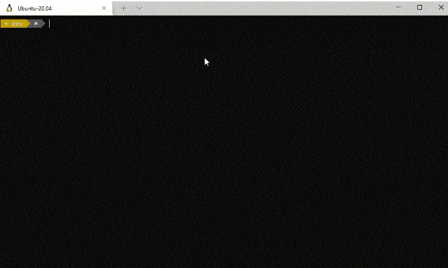

# `cheat`

Bash script to add a cheat sheet as your Windows Terminal background.  Works for Ubuntu on WSL.



# Installation

```bash
sudo apt-get update

# install dependencies
sudo apt-get install imagemagick
sudo apt-get install jq

# download the repository
sudo apt-get install git
git clone --depth 1 -c core.autocrlf=false https://github.com/potatopeelings/cheat ~/usr/local/scripts/potatopeelings-cheat

# add to ~/.bashrc and reload
echo 'alias cheat='\''bash ~/usr/local/scripts/potatopeelings-cheat/src/cheat.sh'\''' >> ~/.bashrc
source ~/.bashrc
```

# Usage

To apply the sample cheat sheet

```console
cheat -a sample
```

To use an image

```console
cheat -a path/to/img
```

You can add your own cheat sheets

```console
cheat -e eggs
```

Once you've saved the contents, apply it

```console
cheat -a eggs
```

## Advanced

For the full list of commands, run `cheat -h`

Override defaults by setting the followingn environment variables in `~/bashrc`

| Variable           | Default       | Description |
| :----------------- | :-----------: | ----------- |
| `CHEAT_ALIGNMENT`  | `topRight`    | Cheat sheet alignment. See [Appearance profile settings in Windows Terminal](https://docs.microsoft.com/en-us/windows/terminal/customize-settings/profile-appearance#background-images-and-icons) > Background image alignment |
| `CHEAT_COLOR`      | `white`       | Font color           |
| `CHEAT_FONT_SIZE`  | `12`          | Font size            |
| `CHEAT_OPACITY`    | `0.3`         | Cheat sheet opacity  |
| `CHEAT_SIZE`       | `400x600`     | Cheat sheet size     |

Your sheets are saved in `./usr/local/scripts/potatopeelings-cheat/src/sheets` in case you need to back them up, or take them with you.

# Thanks

- Scot Hanselman's [Build Reaction Gifs](https://www.hanselman.com/blog/adding-reaction-gifs-for-your-build-system-and-the-windows-terminal) for the inspiration
- The wonderful people at Microsoft who worked on Windows Terminal

